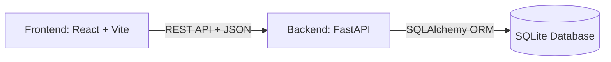

<div align="center">
  <h1>Transaction Ranking System</h1>

  <p>
    
    
    
    
    
    
  </p>

  <p align="center">
    A robust, full-stack web application designed to process financial transactions, compute dynamic user rankings, and visualize activity through an immersive, dark-themed dashboard. Inspired by premium modern interfaces, it features fluid cubic-bezier animations and optimized API data handling.
  </p>
</div>

## 🚀 Live Demo

- **Frontend URL:** [Add your deployed Frontend URL here]
- **Backend URL:** [Add your deployed Backend URL here]

---

## 🏗️ System Architecture



---

## ✨ Key Features

### 1. Interactive Dashboard
- Real-time visualization of transaction history using Recharts.
- Floating navigation dock and smooth momentum-based scrolling.
- Glassmorphism UI components with interactive hover physics.

### 2. Fair Ranking Algorithm
Users are ranked based on a multi-factor algorithm that normalizes various metrics to ensure fairness:
- **Volume (40%):** Total amount transacted, normalized against the highest spender.
- **Frequency (20%):** Number of transactions, normalized against the most active user.
- **Recency (20%):** Time since the last transaction, decaying over 30 days.
- **Reliability (20%):** A trust score that penalizes users for suspected micro-transaction farming.

### 3. Concurrency & Idempotency
To prevent race conditions (e.g., a user double-clicking "Submit" causing duplicate transactions):
- Every transaction request must include an `Idempotency-Key` header (UUID v4).
- The database enforces a `UNIQUE` constraint on the `(idempotency_key, user_id)` pair.
- If a duplicate request arrives simultaneously, the database locks the transaction and safely rejects the duplicate, returning the originally stored response instead of processing it twice.

---

## 📁 Folder Structure

```text
transaction-ranking-system/
├── backend/
│   ├── crud.py               # Database operations & aggregations
│   ├── database.py           # SQLAlchemy setup & connection
│   ├── main.py               # FastAPI entry point & API routes
│   ├── models.py             # SQLite database models
│   ├── ranking.py            # Ranking algorithm logic
│   ├── schemas.py            # Pydantic validation schemas
│   └── requirements.txt      # Python dependencies
├── frontend/
│   ├── src/
│   │   ├── components/ui/    # Reusable UI components & layouts
│   │   ├── lib/              # Utility functions
│   │   ├── pages/            # Dashboard, Summary, and Leaderboard views
│   │   ├── store/            # Zustand global state (useStore.js)
│   │   ├── App.jsx           # Router and application wrapper
│   │   ├── index.css         # Tailwind, animations, custom scrollbars
│   │   └── main.jsx          # React entry point
│   ├── package.json          # NPM dependencies
│   ├── tailwind.config.js    # Tailwind configuration
│   └── vite.config.js        # Vite configuration
└── README.md                 # Project documentation
```

---

## 💻 Setup & Installation

### Prerequisites
- Node.js (v18+)
- Python (3.9+)

### 1. Start the Backend
Navigate to the backend directory and set up the Python environment:
```bash
cd backend

# Create and activate virtual environment
python -m venv venv
source venv/bin/activate  # On Windows use: venv\Scripts\activate

# Install dependencies
pip install -r requirements.txt

# Start the FastAPI server
uvicorn main:app --reload
```
The API will be available at `http://127.0.0.1:8000`. You can view the interactive Swagger documentation at `http://127.0.0.1:8000/docs`.

### 2. Start the Frontend
In a new terminal window, navigate to the frontend directory:
```bash
cd frontend

# Install Node modules
npm install

# Start the development server
npm run dev
```
The application will be accessible at `http://localhost:5173`.

---

## 📡 API Endpoints

| Method | Endpoint | Description |
|--------|----------|-------------|
| `POST` | `/transaction` | Process a new credit/debit transaction (Requires `Idempotency-Key` header) |
| `GET`  | `/summary/{user_id}` | Fetch the financial summary and activity timeline for a specific user |
| `GET`  | `/ranking` | Retrieve the global leaderboard sorted by the ranking algorithm |

---

## 🤝 Contributing
Contributions, issues, and feature requests are welcome! Feel free to fork the repository and submit a pull request.
